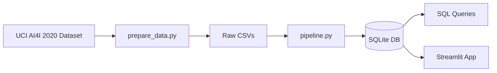
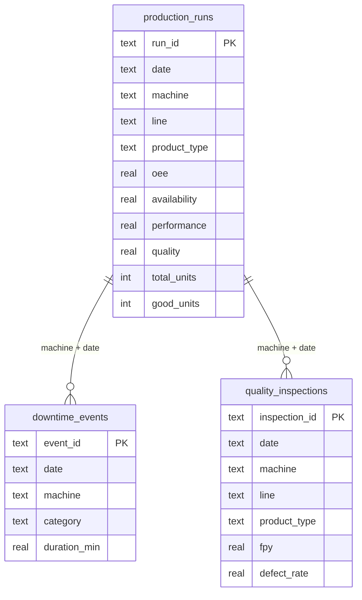

# Manufacturing Analytics Dashboard

SQL + Python ETL pipeline and Streamlit dashboard built on the UCI AI4I 2020 predictive maintenance dataset.

## Quick Start

```bash
git clone https://github.com/maitry-rawal/erp-analytics-dashboard.git
cd erp-analytics-dashboard
python setup.py
```

## Architecture



## Data Model



## SQL Queries

| Query | Purpose |
|---|---|
| `oee_calculation.sql` | OEE by machine/date/shift with classification tier |
| `production_summary.sql` | Daily rollup with rolling 7-day OEE average |
| `downtime_analysis.sql` | Pareto analysis of downtime by category with cumulative % |
| `cost_variance.sql` | Cost per unit by product type and machine, waste analysis |
| `inventory_aging.sql` | Tool wear buckets per machine with failure rates |

## Dashboard

Four tabs: **Overview** (KPIs, daily OEE trend, OEE by machine), **OEE Analysis** (component breakdown, shift comparison, distribution), **Downtime** (Pareto chart, machine breakdown, recent events), **Quality** (FPY trend, defect rates, worst machines). Sidebar filters for production line and product type.

## Tech Stack

Python, pandas, SQLite, Streamlit, Plotly, ucimlrepo

## Project Structure

```
├── app.py                  # Streamlit dashboard
├── setup.py                # One-command setup
├── requirements.txt
├── etl/
│   ├── prepare_data.py     # UCI dataset download & reshape
│   └── pipeline.py         # CSV → transform → SQLite
├── sql/
│   ├── oee_calculation.sql
│   ├── production_summary.sql
│   ├── downtime_analysis.sql
│   ├── cost_variance.sql
│   └── inventory_aging.sql
└── data/
    ├── raw/                # Generated CSVs
    └── manufacturing.db    # SQLite (gitignored)
```

## Data Source

[UCI Machine Learning Repository — AI4I 2020 Predictive Maintenance Dataset](https://archive.ics.uci.edu/dataset/601/ai4i+2020+predictive+maintenance+dataset). 10,000 synthetic records reflecting real-world manufacturing conditions.
